# **Cost Volume Pyramid Based Depth Inference for Multi-View Stereo**

In this blog post, I will review the paper [Cost Volume Pyramid Based Depth Inference for Multi-View Stereo](https://openaccess.thecvf.com/content_CVPR_2020/html/Yang_Cost_Volume_Pyramid_Based_Depth_Inference_for_Multi-View_Stereo_CVPR_2020_paper.html) from Jiayu Yang et al. published in CVPR 2020. After introducing the topic and relevant background knowledge, I will explain the method in my own words. Then we will discuss the results and future works. You can also download [my presentation slides of the paper](PaperPresentation.pptx) and view the slides locally by powerpoint.

# Introduction

==Multi-view stereo (MVS) aims to reconstruct the 3D model of a scene from a set of images captured by a camera from multiple viewpoints.== It is a fundamental problem for computer vision community and has application in 3D reconstruction and virtual reality. 

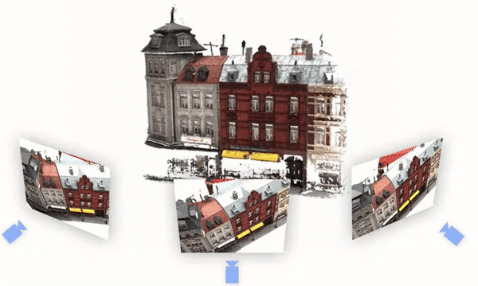

centered text

This paper addresses the MVS problem by depth inference, i.e. by inferring the depth map for an image using its neighboring images. The 3D point cloud of the scene can by built directly on the estimated depth map. We refer to the image in interest as the **source image** and its neighboring images as **reference images**. Another important thing to notice is that ==the camera poses(rotation, translation) and intrinsics of each viewpoint are **known**==. And here lies the different between MVS problem with SLAM or Structure from Motion, in which camera poses and 3D model of the scene are jointly estimated. 

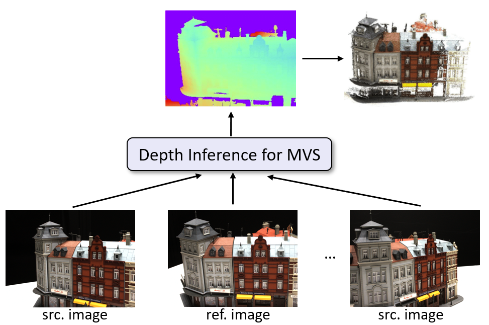

Given the reference image and its neighboring source images, depth inference for MVS aims to infer the depth map for the refence image. 

## Background knowledge
Some background concepts need to be introduced before we dive into the paper. In this section, camera projection, epipolar line, photometric consistency and cost volume will be introduced and explained. The former three might be familiar with you if you have some experience in computer vision, while cost volume is a specific and relatively new concept.

### Camera projection

For a 3D point $ (X,Y,Z) $ in world frame, its corresponding pixel position $ (u,v)$ on the image plane is given as follows：
$$
\lambda (u,v,1)^T = K [\hspace{0.1cm}R \hspace{0.1cm}|\hspace{0.1cm} t\hspace{0.1cm}](X,Y,Z,1)^T
$$
where $\lambda$ is the depth of the pixel, $K$ is the camera intrinsic matrix, $R \in SO(3)$ and $t$ are the extrinsics, i.e. the camera rotation and translation.

The rotation and translation transform the coordinates of the 3D point from world frame into camera frame, and the intrinsic matrix further transform the 3D point from camera frame into image plane. 

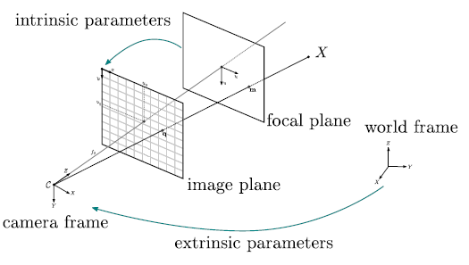

Note that the preimage of a pixel on image plane will be a line in 3D space. If we want to transform a pixel on the image plane back to the world frame with no knowledge of the depth, the corresponding 3D point (a.k.a the preimage of the pixel) lies on a ray and we don't know where the point is without knowing the depth.

With the camera intrinsics and camera poses of each view, we can transform between different views and easily reproject the pixel into other views.

### Epipolar line
If the depth of a pixel is unknown, the reprojection of a pixel of viewpoint 1 into viewpoint 2 lies on a line named epipolar line. This is straightforward since the preimage of the pixel in viewpoint 1 is a line in 3D space, and the projection of this 3D line into viewpoint 2 is also a line.
### Photometric consistency
Photometric consistency is a commonly used constraint in computer vision which assumes that **the same 3D point projected into different viewpoints should be of similar color**. For large lighting changes or non-lambertian surfaces, this constraint might not hold true. But in general, photometric consistency holds for most pixels in the image.
With photometric consistency, the depth of the pixel could be estimated by minimizing the reprojection error.
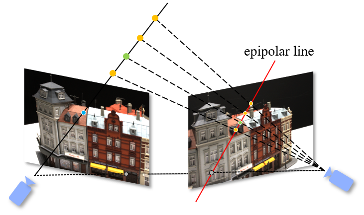
For example, in the above figure, we want to fine the reprojection of the blue pixel in the right view. The depth of the blue pixel is unknown, so we assume four depth hypotheses. Each depth hypothesis gives a possible reprojection of the blue pixel in the right view. For each depth hypothesis, we compute the reprojection error (the difference between the original pixel value and the reprojected pixel value). The best depth hypothesis is chosen as the one which gives the smallest reprojection error. We can sample more depth hypotheses and get a more accurate depth estimation.

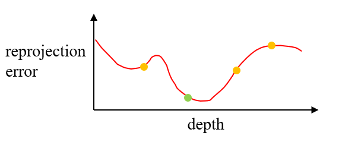

 Of the four depth hypotheses, the green one results in the smallest reprojection error and will be chosen. 

### Cost volume
Cost volume is the specific background knowledge of this paper and you will only know it if you read some papers about MVS.

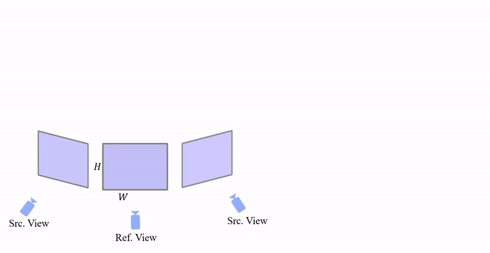

 The construction of cost volume 

Suppose we have two source views, as shown above. Recall that reference view is the view in interest and we want to estimate its depth map; and source views are neighboring views of the reference view. The image dimension is $H \times W$.  For each pixel in the reference view, we sample $M$ (4 in the above figure) depth hypotheses (e.g. uniformly sampling) in the depth range. Then each depth hypothesis is projected to the source views. For each depth hypothesis, we compute the variance of features across all three views, and the resulted variance is one voxel in the cost volume. Repeating the above process for all pixels in the reference view and all depth hypotheses, we will have a cost volume of size $H \times W \times M$.  According to photometric consistency, a small variance indicates a relatively accurate depth hypothesis. The variance is a cost metric for the depth hypothesis, hence the name cost volume.

Mathematically, given a reference view $I_0 \in \R ^{H \times W}$ and its $N$ neighboring source views $\{I_i\}_{i=1}^{N}$. Let $\{K_i,R_i, t_i\}^N_{i
=0}$ denote the corresponding camera intrinsics, rotation matrix, and translation vector for all views. The depth range is between $d_{min}$ and $d_{max}$ and $M$ depth hypotheses are sampled uniformly in the depth range. For pixel $p=(u,v)^T$ in reference view and the $m$-th depth hypothesis, the cost volume value is given by:
$$
C_m(p) = \frac{1}{N+1}\sum_{i=0}^{N} (I_i(\Pi(p,d(m)))-\bar{I}(p,m))^2
$$
where

 $d(m)=d_{min}+m(d_{max}-d_{min})/M$, $m \in \{0,1,2,...,M-1\}$; 

$\Pi$ is the warping function: $\Pi(p,d(m)) = (\pi_1/\pi_3, \pi_2/\pi_3)^T$ and $\pi = K_i(R_iR_0^{-1}(K_0^{-1}d(m)(u,v,1)^T-t_0)+t_i)$;

$\bar{I}(p,m)$ is the mean value of features: $\tilde{I}(p,m) = \frac{1}{N+1}\sum_{i=0}^{N} I_i(\Pi(p,d(m)))$

# Related work
While [traditional methods](http://szeliski.org/papers/Seitz-CVPR06.pdf) before deep learning era have great achievements on the reconstruction of a scene with Lambertian surfaces, they still suffer from illumination changes, low-texture regions, and reflections resulting in unreliable matching correspondences for further reconstruction. 

Recent learning-based approaches adopt deepCNNs to infer the depth map for each view followed by a separate multiple-view fusion process for building 3D models. These methods allow the network to extract discriminative features encoding global and local information of a scene to obtain robust feature matching for MVS. 

In particular, Yao *et al.* propose [MVSNet](https://openaccess.thecvf.com/content_ECCV_2018/html/Yao_Yao_MVSNet_Depth_Inference_ECCV_2018_paper.html) to infer a depth map for each view. An essential step in MVSNet is to build a cost volume based on a plane sweep process followed by multiscale 3D CNNs for regularization. While effective in depth inference accuracy, its memory requirement is cubic to the image resolution. To allow handling high resolution images, they then adopt a recurrent cost volume regularization process ([R-MVSNet](https://openaccess.thecvf.com/content_CVPR_2019/html/Yao_Recurrent_MVSNet_for_High-Resolution_Multi-View_Stereo_Depth_Inference_CVPR_2019_paper.html)). However, the reduction in memory requirements involves a longer run-time.

|   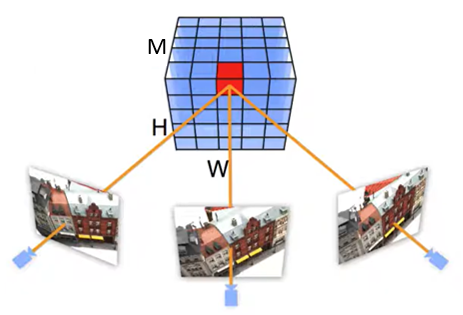   |    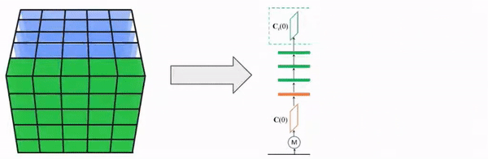    |
| :------------------------: | :--------------------------: |
| MVSNet (Yao *et al.* 2018) | R-MVSNet (Yao *et al.* 2019) |

In order to achieve a computationally efficient network, [Point-MVSNet(Chen *et al.* 2019)](https://openaccess.thecvf.com/content_ICCV_2019/html/Chen_Point-Based_Multi-View_Stereo_Network_ICCV_2019_paper.html)  works on 3D point clouds to iteratively predict the depth residual along visual rays using edge convolutions operating on the k nearest neighbors of each 3D point. While this approach is efficient, its run-time increases almost linearly with the number of iteration levels.

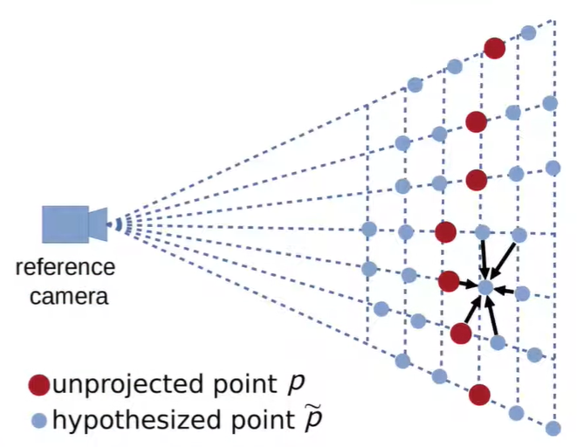

 Point-MVSNet(Chen et al. 2019) 

The key novelty of  the presented method (CVP-MVSNet) is building a cost volume pyramid in a coarse-to-fine manner instead of constructing a cost volume at a fixed resolution, which leads to a compact, lightweight network and allows inferring high resolution depth maps to achieve better reconstruction results.
# Method
In this part, I will explain the methodology of the presented paper (CVP-MVSNet). First I will state the problem formally. Then each part of the method will be explained separately. Finally an overview will be given.
## Problem statement
Denote the reference image as $I_0 \in \R^{𝐻×𝑊}$, where 𝐻 and 𝑊 defines its dimensions. Let $\{𝐼_𝑖\}_{i=1}^𝑁$ be its 𝑁 neighboring source images. The corresponding camera intrinsics, rotation matrix, and translation vector for all views $\{K_i,R_i, t_i\}^N_{i
=0}$ are known. 
The goal is to infer the depth map $D$ for $I_0$ from $\{𝐼_𝑖\}_{i=1}^𝑁$ .

## Feature pyramid
The feature extraction pipeline consists of two steps. First a $(L+1)$-level image pyramid $\{I_i^j\}_{j=0}^L$ for each input image is built, $i \in \{0,1,...,N\}$, where the bottom level of the pyramid corresponds to the input image, $I_i^0=I_i$. Second, feature representations at the $l$-th level are obtained by feeding the image into a CNN, namely *feature extraction network*. Note that the CNN at different level of the pyramid are the same, i.e. weights of the CNN are shared.
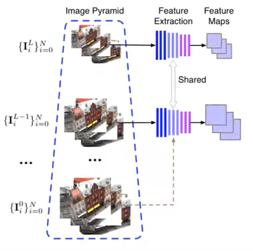

The resulting feature map at level $l$ is denoted as $\{f_i^l\}_{i=0}^N, f_i^l \in \R^{H/2^l\times W/2^l\times F}$, where $F$ is the number of feature channels.

## Cost volume pyramid
In the introduction part, cost volume is built directly on images. In practice, building cost volume on learnable features is more robust against illumination changes. Also, previously I only mentioned that the depth hypotheses could be sampled uniformly in the depth range $(d_{min}, d{max})$,  which is adopted in [MVSNet](https://openaccess.thecvf.com/content_ECCV_2018/html/Yao_Yao_MVSNet_Depth_Inference_ECCV_2018_paper.html) and is proven to be too memory consuming. The key novelty of this paper is about iterative sampling of the depth hypotheses in a coarse-to-fine manner. 
**1.Cost volume at coarsest level**: at coarsest level of the feature pyramid, depth hypotheses are uniformly sampled in the whole depth range. The resulting cost volume is then fed into a depth estimator network, which will be introduced below, to predict the depth map at the coarsest level. This step is same as in the introductory part of cost volume.
**2. Iterative refinement**: ==for each level afterwards, the depth search range will be centered around the previously estimated depth with a smaller searching interval, and thus producing more accurate depth map.==

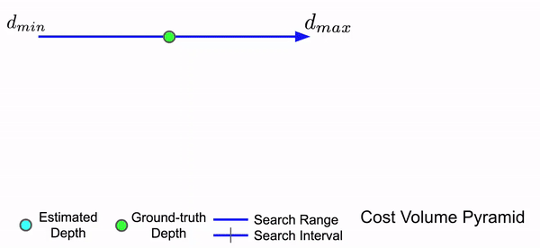

Mathematically, the iterative refinement step can be formulated as follows. Assume we have the depth estimate $D^{l+1}$ at $l+1$ level. $D^{l+1}$ has to be upsampled to match the resolution at level $l$, and the upsampled depth estimate is denoted as $D^{l+1}_{\uparrow}$. Current initial depth estimate for each pixel $p=(u,v)$ is defined as $d_p=D^{l+1}_{\uparrow}(u,v)$. Let each depth residual hypothesis interval be $\Delta d_p=s_p/M$, where $s_p$ represents the depth search range at $p$ and $M$ denotes the number of sampled depth residual. The $l$ level cost volume value at pixel $p$ can be computed as follows:
$$
C_m^l=\frac{1}{N+1}\sum^N_{i=0}(f_i^l(\Pi(p,m))-\bar{f^l}(p,m))^2
$$
where

$\Pi$ is the warping function: $\Pi(p,m) = (\pi_1/\pi_3, \pi_2/\pi_3)^T$ and $\pi = K_i^l(R_iR_0^{-1}({K_0^l}^{-1}(u,v,1)^T(d_p+m\Delta d_p)-t_0)+t_i)$;

$\bar{f^l}(p,m)$ is the mean of features: $\bar{f^l}(p,m) =\frac{1}{N+1}\sum^N_{i=0}f_i^l(\Pi(p,m))$;

$m \in \{-M/2,...,M/2-1\}$.

The resulting cost volume at level $l$ is denoted as $C^l \in \R^{H/2^l\times W/2^l\times M \times F}$. The cost volume pyramid is thus $\{C^l\}^L_{l=0}$

## Depth map estimator
Given the constructed cost volume at level $l$, we need to estimate the depth map at level $l$ which will be further passed down to level $l-1$ as its initial depth estimation. The estimation of depth map from cost volume is achieved by applying a 3D convolution network to aggregate context information and output probability volumes $\{P^l\}^L_{l=0}$, where $P^l \in \R ^{H/2^l\times W/2^l\times M}$.

The resulting depth map is simply a **weighted sum** of each channels of the probability volume, whereas the weights are the corresponding depth hypotheses. 

At the coarsest level $L$, the depth estimate for each pixel $p$ is computed as:
$$
D^L(p) = \sum_{m=0}^{M-1}dP_p^L(d)
$$
where $d=d_{min}+m(d_{max}-d_{min})/M$ is the sampled depth.

For lower levels at the pyramid, assume $r_p=m\Delta d_p^l$denotes the depth residual hypothesis, the depth estimate is given by:
$$
D^l(p)=D^{l+1}_{\uparrow}+\sum_{m=-M/2}^{M/2-1}r_pP_p^l(r_p)
$$
where $l \in \{L-1, L-2,...0\}$

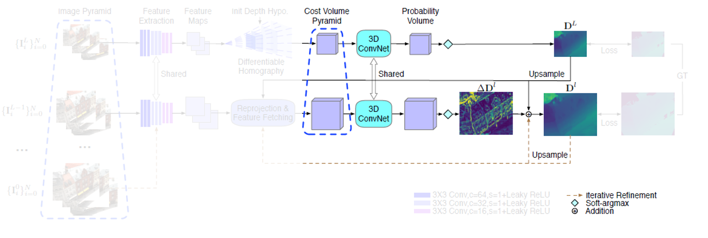

## Loss function

The loss function of the network is simply a $l_1$ norm measuring the absolute difference between the ground truth and the estimated depth. Note that the  ground truth depth map is also down-sampled to the corresponding level. For each training sample, the loss is:
$$
Loss = \sum_{l=0}^l\sum_{p \in \Omega} ||D^l_{GT}(p)-D^l(p)||_1
$$
where $\Omega$ is the set of valid pixels with ground truth measurements.
## Sum up

The entire network structure is shown below. Reference and source images are first down-sampled to form an image pyramid. We apply feature extraction network to all levels and images to extract feature maps. We then build the cost volume pyramid in a coarse-to-fine manner. Specifically, we start with the construction of a cost volume corresponding to coarsest image resolution followed by building partial cost volumes iteratively for depth residual estimation in order to achieve depth map for the reference image.

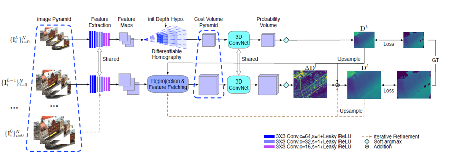

# Experiments
## Dateset
[**DTU Dataset**](https://roboimagedata.compute.dtu.dk/)**** is used for train and test. DTU dataset includes table top objects in laboratory lighting conditions.

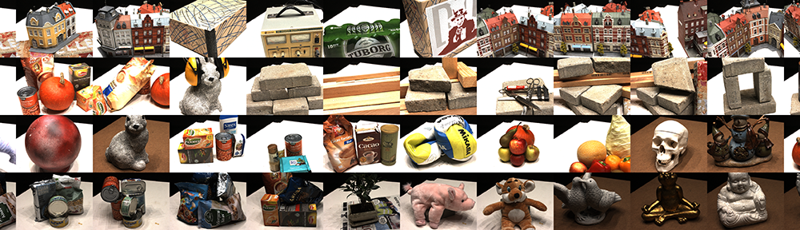

 DTU Dataset 

[**Tanks and Temples Dataset**](https://www.tanksandtemples.org/)**** is only used for test. DTU dataset includes table top objects in laboratory conditions. This dataset includes indoor and outdoor scenes under realistic lighting conditions.

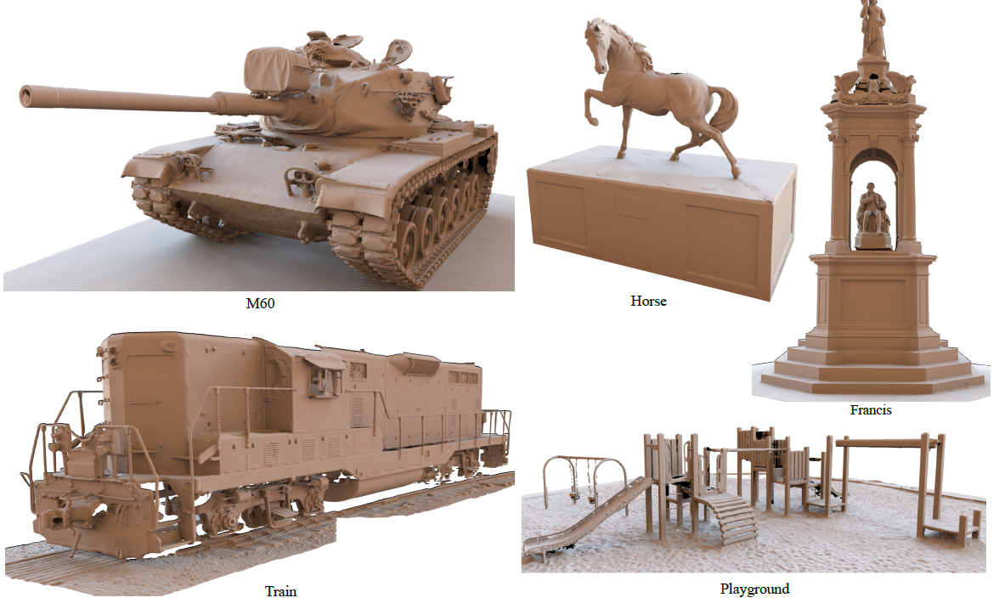

 Tanks and Temples 

## Metrics

*Accuracy*, *completeness* and *overall score* are used to evaluate the quality of reconstructed point clouds.

Denote the ground truth model as $G$ and the reconstructed model as $R$. 

- Accuracy is the distance from $R$ to $G$;

- Completeness is the distance from $G$ to $R$

- Overall score is the average of accuracy and completeness.

  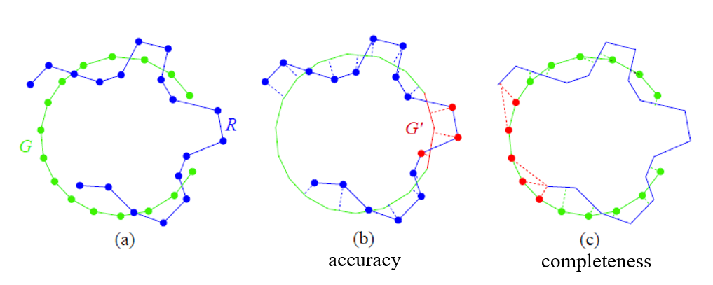

The names of the metrics are kind of self-explaining. If only accuracy were reported, it would favor algorithms that only include estimated points of high certainty, e.g. high-textured surface parts.  On the other hand, if only completeness were reported it would favor algorithms that include everything, regardless of point quality.

## Qualitative results

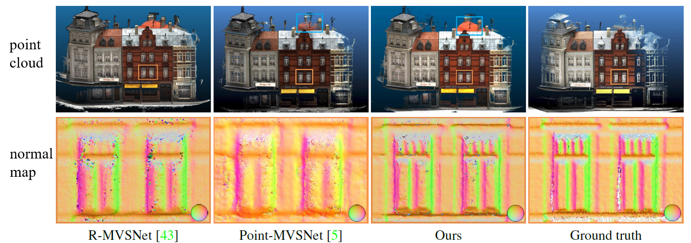

 Results on DTU test set. The upper row shows the point clouds and the bottom row shows the normal map corresponding to the orange rectangle. As highlighted in the blue rectangle, the completeness of the proposed method is better than Point-MVSNet. The normal map (orange rectangle) further shows that the proposed method is smoother on surfaces while maintaining more high-frequency details.

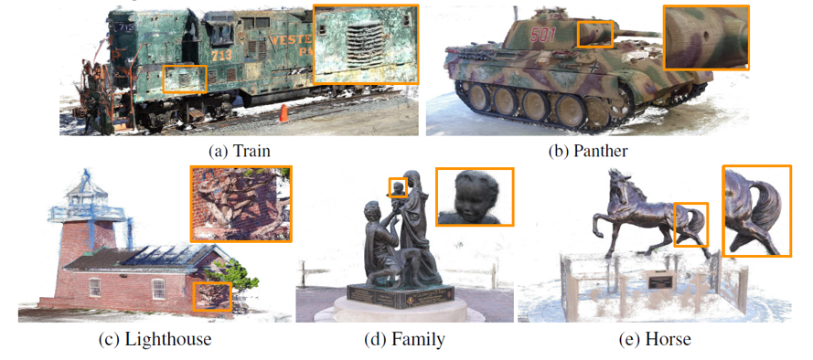

Point cloud reconstruction on Tanks and Temple dataset.  Note that the model has not trained/fine-tuned on this dataset. This result shows that the presented method has a good generalization ability.

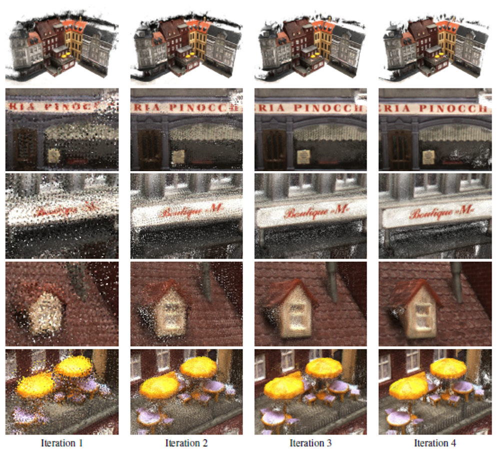

Intermediate point cloud results. Note that the reconstruction quality improved for every iteration of depth residual refinement. 

## Quantitative results

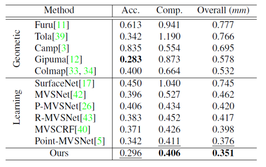

Quantitative results of reconstruction quality on DTU dataset (lower is better). The presented method outperforms all methods on completeness and overall reconstruction quality and achieved seconad best on Accuracy.

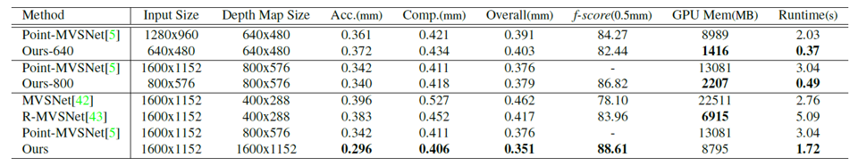

Comparison of reconstruction quality, GPU memory usage and runtime on DTU dataset for different input sizes. For the same size of depth maps, the proposed method has a performance similar with Point-MVSNet, and is 6 times faster and consumes 6 times smaller GPU memory. For the same size of input images, the proposed method achieves the best reconstruction with the shortest time and a reasonable GPU memory usage.

# Discussion

The main contribution of this paper is building a pyramid structure in a coarse-to-fine manner. To be honest, I think the methodology does not has much novelty, since coarse-to-fine manner or the pyramid structure is a common approach (e.g. in optical flow, motion estimation and frame interpolation) to increase speed and reduce memory requirement. If one have read the [MVSNet](https://openaccess.thecvf.com/content_ECCV_2018/html/Yao_Yao_MVSNet_Depth_Inference_ECCV_2018_paper.html) paper, one will find that the method in this paper is nothing but a small improvement of the MVSNet. 

However, the devil is in the details, as the saying goes. Although the basic idea of this paper is straight forward, a lot of implementation details have to be determined carefully to achieve state-of-the-art results. For example, the choice of depth hypotheses number $M$, the depth search range, the level $L$, the choice of network architecture and so on, those parameters cannot be chosen arbitrarily. For the chosen of $M$, the authors used a "0.5 pixel distance" method to avoid too dense sampling. For the depth search range, a "2 pixel length" method is used to determine a proper search range. Interested readers are referred to the [original paper](https://openaccess.thecvf.com/content_CVPR_2020/html/Yang_Cost_Volume_Pyramid_Based_Depth_Inference_for_Multi-View_Stereo_CVPR_2020_paper.html) to get those details.

One possible improvement would be to jointly estimate the depth map for both reference image and source images, and output the merged 3D point cloud directly. In this paper, the output is only a depth map for a single image. In some cases, we might want the 3D model of a scene and combining different viewpoints could make the reconstruction more complete.
